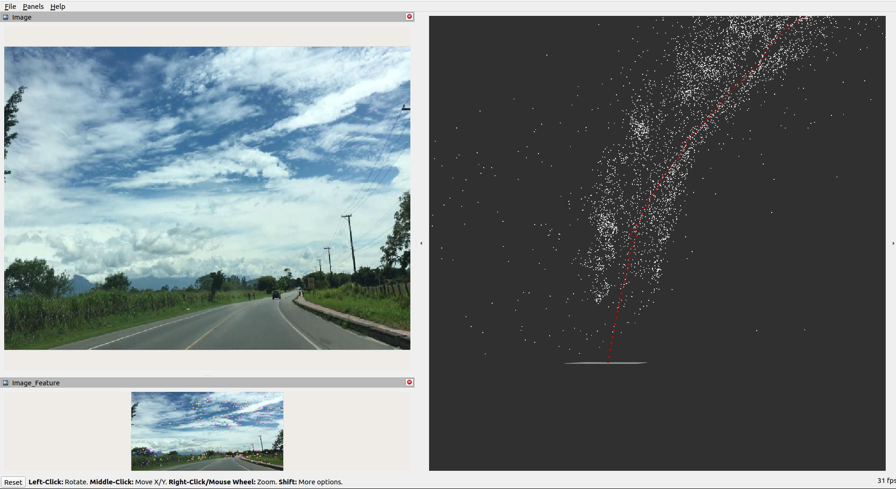

## ros2_monocular_slam

----
### Screenshot



----

### 1. Executable files

**[Terminal 1]**
```
# pwd
> ~/ROS_Robotics_Playgrounds

# build
colcon build --symlink-install --packages-select ros2_monocular_slam

# update environment
source ./install/local_setup.bash

# run
ros2 run ros2_monocular_slam vod_img_pub data/car.mp4
```

**[Terminal 2]**
```
# update environment
source ./install/local_setup.bash

# run
ros2 run ros2_monocular_slam slam_pub
```

**[Terminal 3]**
```
# update environment
source ./install/local_setup.bash

# run
rviz2 -d src/ros2_monocular_slam/rviz/py_slam_ros2_v4.rviz
```

----

### 2. Launch file

**[Terminal 1]**
```
# pwd
> ~/ROS_Robotics_Playgrounds

# build
colcon build --symlink-install --packages-select ros2_monocular_slam

# update environment
source ./install/local_setup.bash

# run
ros2 launch ros2_monocular_slam slam.launch.py
```

